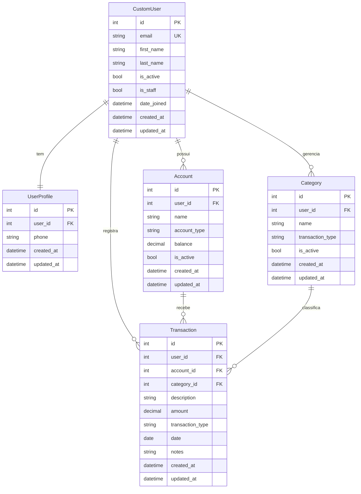

# PRD — Finanpy: Sistema de Gestão de Finanças Pessoais

---

## 1. Visão Geral

O **Finanpy** é um sistema web de gestão de finanças pessoais construído com Django full stack. O produto permite que usuários cadastrados registrem, categorizem e acompanhem suas movimentações financeiras — entradas, saídas e transferências — distribuídas entre múltiplas contas bancárias, tudo em uma interface moderna com fundo escuro e identidade visual consistente.

---

## 2. Sobre o Produto

| Atributo        | Valor                                           |
|-----------------|-------------------------------------------------|
| Nome            | Finanpy                                         |
| Versão inicial  | 1.0 (MVP)                                       |
| Plataforma      | Web (Django 6.x + TailwindCSS + SQLite)         |
| Acesso          | Autenticado por e-mail                          |
| Idioma da UI    | Português Brasileiro                            |
| Idioma do código| Inglês                                          |

---

## 3. Propósito

Oferecer uma ferramenta simples, rápida e visualmente agradável para que pessoas físicas possam registrar e visualizar sua vida financeira sem depender de planilhas ou aplicativos complexos. O foco é clareza, simplicidade de uso e confiabilidade dos dados.

---

## 4. Público-Alvo

- Pessoas físicas que desejam controle básico de suas finanças pessoais.
- Usuários com pouca ou nenhuma experiência em ferramentas financeiras.
- Pessoas que preferem uma interface desktop-first, acessível também em mobile.
- Perfil: adultos entre 20 e 50 anos, com renda mensal e múltiplas contas.

---

## 5. Objetivos

1. Permitir o cadastro e login de usuários via e-mail.
2. Permitir o gerenciamento de múltiplas contas bancárias por usuário.
3. Permitir o registro de transações (entrada, saída).
4. Permitir a categorização das transações.
5. Apresentar um dashboard com resumo financeiro do período.
6. Garantir que cada usuário veja apenas seus próprios dados.
7. Oferecer uma identidade visual consistente e moderna em todas as telas.

---

## 6. Requisitos Funcionais

### 6.1 Site Público (Landing Page)

- RF01 — Exibir página inicial pública com apresentação do produto.
- RF02 — Exibir botões de "Cadastre-se" e "Entrar" na landing page.
- RF03 — A landing page não deve exigir autenticação.

### 6.2 Autenticação

- RF04 — Permitir cadastro de novo usuário com nome, e-mail e senha.
- RF05 — Realizar login via e-mail (não via username).
- RF06 — Realizar logout do usuário autenticado.
- RF07 — Redirecionar usuário autenticado para o dashboard após login.
- RF08 — Redirecionar usuário não autenticado para login ao acessar área protegida.

### 6.3 Perfil do Usuário

- RF09 — Exibir e permitir edição do perfil (nome, e-mail, telefone).
- RF10 — Exibir a data de criação da conta.

### 6.4 Contas Bancárias

- RF11 — Listar as contas bancárias do usuário.
- RF12 — Criar nova conta com nome, tipo e saldo inicial.
- RF13 — Editar conta existente.
- RF14 — Desativar/reativar conta (soft delete).
- RF15 — Tipos de conta: Conta Corrente, Poupança, Cartão de Crédito, Investimento, Dinheiro.

### 6.5 Categorias

- RF16 — Listar categorias do usuário.
- RF17 — Criar nova categoria com nome e tipo (receita ou despesa).
- RF18 — Editar categoria existente.
- RF19 — Desativar/reativar categoria.
- RF20 — Categorias são pessoais — cada usuário gerencia as suas.

### 6.6 Transações

- RF21 — Listar transações do usuário com filtros por período, conta e categoria.
- RF22 — Criar transação com: descrição, valor, tipo, data, conta e categoria.
- RF23 — Tipos de transação: Receita, Despesa.
- RF24 — Editar transação existente.
- RF25 — Excluir transação (hard delete com confirmação).
- RF26 — Transações afetam o saldo da conta vinculada.

### 6.7 Dashboard

- RF27 — Exibir saldo total consolidado de todas as contas ativas.
- RF28 — Exibir total de receitas do mês corrente.
- RF29 — Exibir total de despesas do mês corrente.
- RF30 — Exibir saldo líquido do mês (receitas − despesas).
- RF31 — Listar as 5 transações mais recentes.

---

### 6.8 Flowchart — Fluxos de UX


---

## 7. Requisitos Não-Funcionais

- RNF01 — O sistema deve ser responsivo (mobile-first via TailwindCSS).
- RNF02 — O tempo de resposta de qualquer página não deve ultrapassar 2 segundos em condições normais.
- RNF03 — Toda área autenticada deve exigir login ativo.
- RNF04 — Dados de um usuário não devem ser acessíveis por outro.
- RNF05 — Senhas devem ser armazenadas com hash (Django padrão — PBKDF2).
- RNF06 — O código deve seguir PEP 8 e usar aspas simples.
- RNF07 — O banco de dados será SQLite (arquivo local `db.sqlite3`).
- RNF08 — Toda model deve possuir os campos `created_at` e `updated_at`.
- RNF09 — O sistema não usará Docker na versão MVP.
- RNF10 — O sistema não implementará testes automatizados na versão MVP.
- RNF11 — O frontend utilizará exclusivamente Django Template Language + TailwindCSS (via CDN no MVP).
- RNF12 — O sistema usará Class Based Views sempre que possível.
- RNF13 — Signals, quando necessários, devem residir em `signals.py` dentro do app correspondente.

---

## 8. Arquitetura Técnica

### 8.1 Stack

| Camada         | Tecnologia                        |
|----------------|-----------------------------------|
| Backend        | Python 3.14+ / Django 6.x         |
| Frontend       | Django Template Language (DTL)    |
| CSS            | TailwindCSS (CDN no MVP)          |
| Banco de dados | SQLite                            |
| Autenticação   | Django Auth nativo (CustomUser)   |
| Servidor dev   | Django runserver                  |
| Ambiente       | venv (`.venv`)                    |

### 8.2 Estrutura de Diretórios

```
finanpy/
├── core/               # configurações globais (settings, urls, wsgi, asgi)
├── users/              # CustomUser — login por e-mail
├── profiles/           # perfil estendido do usuário (1:1 com CustomUser)
├── accounts/           # contas bancárias do usuário
├── categories/         # categorias de transações
├── transactions/       # lançamentos financeiros
├── templates/          # templates globais (base, landing, auth, dashboard)
│   ├── base.html
│   ├── landing.html
│   ├── users/
│   ├── profiles/
│   ├── accounts/
│   ├── categories/
│   └── transactions/
├── static/             # arquivos estáticos globais (css, js, img)
├── manage.py
├── db.sqlite3
└── requirements.txt
```

### 8.3 Esquema de Dados (Mermaid ERD)



### 8.4 Choices de Campos

```python
# Account.account_type
ACCOUNT_TYPES = [
    ('checking',    'Conta Corrente'),
    ('savings',     'Poupança'),
    ('credit',      'Cartão de Crédito'),
    ('investment',  'Investimento'),
    ('cash',        'Dinheiro'),
]

# Category.transaction_type / Transaction.transaction_type
TRANSACTION_TYPES = [
    ('income',   'Receita'),
    ('expense',  'Despesa'),
]
```

---

## 9. Design System

### 9.1 Paleta de Cores (TailwindCSS)

| Token              | Classe TailwindCSS              | Uso                                       |
|--------------------|---------------------------------|-------------------------------------------|
| Background base    | `bg-gray-950`                   | Fundo das páginas                         |
| Background card    | `bg-gray-900`                   | Cards, sidebars, modais                   |
| Background alt     | `bg-gray-800`                   | Inputs, linhas de tabela hover            |
| Borda              | `border-gray-700`               | Bordas de cards e inputs                  |
| Primária           | `from-violet-600 to-indigo-600` | Gradiente de botões e destaques           |
| Primária hover     | `from-violet-500 to-indigo-500` | Hover em botões primários                 |
| Acento verde       | `text-emerald-400`              | Valores positivos (receitas, saldo +)     |
| Acento vermelho    | `text-rose-400`                 | Valores negativos (despesas, saldo −)     |
| Acento amarelo     | `text-amber-400`                | Alertas, destaques secundários            |
| Texto principal    | `text-gray-100`                 | Textos de conteúdo                        |
| Texto secundário   | `text-gray-400`                 | Labels, descrições, placeholders          |
| Texto desabilitado | `text-gray-600`                 | Itens inativos                            |

### 9.2 Tipografia

| Elemento           | Classes TailwindCSS                                       |
|--------------------|-----------------------------------------------------------|
| Título H1          | `text-3xl font-bold text-gray-100`                        |
| Título H2          | `text-xl font-semibold text-gray-100`                     |
| Título H3          | `text-lg font-medium text-gray-200`                       |
| Corpo              | `text-sm text-gray-300`                                   |
| Label de form      | `text-xs font-medium text-gray-400 uppercase tracking-wide` |
| Valor monetário    | `text-2xl font-bold tabular-nums`                         |
| Badge/chip         | `text-xs font-medium px-2 py-0.5 rounded-full`           |

Fonte padrão: sistema nativo via `font-sans` do Tailwind (Inter / system-ui).

### 9.3 Botões

```html
<!-- Primário (ação principal) -->
<button class="bg-gradient-to-r from-violet-600 to-indigo-600
               hover:from-violet-500 hover:to-indigo-500
               text-white text-sm font-medium
               px-4 py-2 rounded-lg
               transition-all duration-200
               focus:outline-none focus:ring-2 focus:ring-violet-500 focus:ring-offset-2 focus:ring-offset-gray-900">
  Salvar
</button>

<!-- Secundário (ação neutra) -->
<button class="bg-gray-800 hover:bg-gray-700
               text-gray-300 hover:text-gray-100
               text-sm font-medium
               px-4 py-2 rounded-lg border border-gray-700
               transition-all duration-200">
  Cancelar
</button>

<!-- Perigo (ação destrutiva) -->
<button class="bg-rose-600/20 hover:bg-rose-600/30
               text-rose-400 hover:text-rose-300
               text-sm font-medium
               px-4 py-2 rounded-lg border border-rose-600/30
               transition-all duration-200">
  Excluir
</button>
```

### 9.4 Inputs e Forms

```html
<!-- Campo de input padrão -->
<div class="flex flex-col gap-1">
  <label class="text-xs font-medium text-gray-400 uppercase tracking-wide">
    Descrição
  </label>
  <input type="text"
         class="bg-gray-800 border border-gray-700
                text-gray-100 text-sm
                rounded-lg px-3 py-2
                placeholder-gray-600
                focus:outline-none focus:ring-2 focus:ring-violet-500 focus:border-transparent
                transition-all duration-200">
</div>

<!-- Select padrão -->
<select class="bg-gray-800 border border-gray-700
               text-gray-100 text-sm
               rounded-lg px-3 py-2
               focus:outline-none focus:ring-2 focus:ring-violet-500
               transition-all duration-200">
</select>

<!-- Textarea padrão -->
<textarea class="bg-gray-800 border border-gray-700
                 text-gray-100 text-sm
                 rounded-lg px-3 py-2
                 placeholder-gray-600 resize-none
                 focus:outline-none focus:ring-2 focus:ring-violet-500
                 transition-all duration-200"
          rows="3">
</textarea>
```

### 9.5 Cards

```html
<!-- Card padrão -->
<div class="bg-gray-900 border border-gray-800 rounded-xl p-6 shadow-lg">
  <!-- conteúdo -->
</div>

<!-- Card de métrica (dashboard) -->
<div class="bg-gray-900 border border-gray-800 rounded-xl p-5
            hover:border-gray-700 transition-colors duration-200">
  <p class="text-xs font-medium text-gray-400 uppercase tracking-wide">Saldo Total</p>
  <p class="text-2xl font-bold text-emerald-400 tabular-nums mt-1">R$ 0,00</p>
</div>
```

### 9.6 Layout e Grid

```html
<!-- Layout principal autenticado -->
<div class="min-h-screen bg-gray-950 flex">
  <!-- Sidebar -->
  <aside class="w-64 bg-gray-900 border-r border-gray-800 flex flex-col">
    <!-- logo + nav -->
  </aside>

  <!-- Conteúdo principal -->
  <main class="flex-1 flex flex-col overflow-hidden">
    <!-- Topbar -->
    <header class="h-16 bg-gray-900 border-b border-gray-800 flex items-center px-6">
    </header>
    <!-- Área de conteúdo -->
    <div class="flex-1 overflow-auto p-6">
      <!-- grid de cards: 4 colunas em desktop, 2 em tablet, 1 em mobile -->
      <div class="grid grid-cols-1 sm:grid-cols-2 lg:grid-cols-4 gap-4">
      </div>
    </div>
  </main>
</div>
```

### 9.7 Sidebar / Menu de Navegação

```html
<aside class="w-64 bg-gray-900 border-r border-gray-800 flex flex-col fixed h-full">
  <!-- Logo -->
  <div class="h-16 flex items-center px-6 border-b border-gray-800">
    <span class="text-xl font-bold bg-gradient-to-r from-violet-400 to-indigo-400
                 bg-clip-text text-transparent">
      Finanpy
    </span>
  </div>

  <!-- Navegação -->
  <nav class="flex-1 py-4 px-3 space-y-1">
    <!-- Item ativo -->
    <a href="#" class="flex items-center gap-3 px-3 py-2 rounded-lg
                       bg-violet-600/20 text-violet-400 font-medium text-sm">
      Dashboard
    </a>
    <!-- Item inativo -->
    <a href="#" class="flex items-center gap-3 px-3 py-2 rounded-lg
                       text-gray-400 hover:text-gray-100 hover:bg-gray-800
                       font-medium text-sm transition-colors duration-150">
      Contas
    </a>
  </nav>

  <!-- Rodapé da sidebar (usuário + logout) -->
  <div class="p-4 border-t border-gray-800">
    <div class="flex items-center gap-3">
      <div class="w-8 h-8 rounded-full bg-gradient-to-br from-violet-500 to-indigo-600
                  flex items-center justify-center text-white text-xs font-bold">
        {{ user.first_name.0|upper }}
      </div>
      <div class="flex-1 min-w-0">
        <p class="text-sm font-medium text-gray-200 truncate">{{ user.get_full_name }}</p>
        <p class="text-xs text-gray-500 truncate">{{ user.email }}</p>
      </div>
    </div>
  </div>
</aside>
```

### 9.8 Tabelas

```html
<div class="bg-gray-900 border border-gray-800 rounded-xl overflow-hidden">
  <table class="w-full text-sm">
    <thead>
      <tr class="border-b border-gray-800">
        <th class="text-left px-4 py-3 text-xs font-medium text-gray-400 uppercase tracking-wide">
          Descrição
        </th>
      </tr>
    </thead>
    <tbody class="divide-y divide-gray-800">
      <tr class="hover:bg-gray-800/50 transition-colors duration-150">
        <td class="px-4 py-3 text-gray-300">Conteúdo</td>
      </tr>
    </tbody>
  </table>
</div>
```

### 9.9 Alertas e Mensagens Django

```html

  <div class="space-y-2 mb-4">
    
      <div class="px-4 py-3 rounded-lg text-sm font-medium
        bg-emerald-500/10 text-emerald-400 border border-emerald-500/20
        bg-rose-500/10 text-rose-400 border border-rose-500/20
        bg-amber-500/10 text-amber-400 border border-amber-500/20">
        {{ message }}
      </div>
    
  </div>

```

---

## 10. User Stories

### Épico 1 — Acesso ao Sistema

| ID   | User Story                                                                                               |
|------|----------------------------------------------------------------------------------------------------------|
| US01 | Como visitante, quero ver uma landing page com a descrição do produto para entender o que é o Finanpy.  |
| US02 | Como visitante, quero me cadastrar com nome, e-mail e senha para criar minha conta.                     |
| US03 | Como usuário cadastrado, quero fazer login com meu e-mail e senha para acessar o sistema.               |
| US04 | Como usuário autenticado, quero fazer logout para encerrar minha sessão com segurança.                  |

**Critérios de Aceite — Épico 1:**
- [ ] Landing page exibe título, descrição e botões de cadastro/login visíveis.
- [ ] Formulário de cadastro valida e-mail único, senha mínima de 8 caracteres.
- [ ] Login aceita apenas e-mail (não username).
- [ ] Após login, usuário é redirecionado ao dashboard.
- [ ] Sessão expirada redireciona para login.

---

### Épico 2 — Gestão de Perfil

| ID   | User Story                                                                                              |
|------|----------------------------------------------------------------------------------------------------------|
| US05 | Como usuário, quero visualizar meu perfil com meu nome, e-mail e telefone.                              |
| US06 | Como usuário, quero editar meu nome e telefone para manter meu cadastro atualizado.                     |

**Critérios de Aceite — Épico 2:**
- [ ] Página de perfil exibe nome completo, e-mail e telefone.
- [ ] Formulário de edição salva alterações e exibe mensagem de sucesso.
- [ ] E-mail não pode ser alterado pelo formulário de perfil.

---

### Épico 3 — Contas Bancárias

| ID   | User Story                                                                                                          |
|------|----------------------------------------------------------------------------------------------------------------------|
| US07 | Como usuário, quero listar todas as minhas contas bancárias com seus saldos.                                        |
| US08 | Como usuário, quero criar uma nova conta informando nome, tipo e saldo inicial.                                     |
| US09 | Como usuário, quero editar o nome e o tipo de uma conta existente.                                                  |
| US10 | Como usuário, quero desativar uma conta que não uso mais sem perdê-la do histórico.                                 |

**Critérios de Aceite — Épico 3:**
- [ ] Lista exibe nome, tipo, saldo e status (ativa/inativa) de cada conta.
- [ ] Contas inativas aparecem visualmente distintas (opacidade reduzida).
- [ ] Usuário só vê suas próprias contas.
- [ ] Tipo de conta exibe rótulo em português (ex.: "Conta Corrente").

---

### Épico 4 — Categorias

| ID   | User Story                                                                                              |
|------|----------------------------------------------------------------------------------------------------------|
| US11 | Como usuário, quero listar minhas categorias separadas por receita e despesa.                           |
| US12 | Como usuário, quero criar uma nova categoria com nome e tipo.                                           |
| US13 | Como usuário, quero editar uma categoria existente.                                                     |
| US14 | Como usuário, quero desativar uma categoria que não uso mais.                                           |

**Critérios de Aceite — Épico 4:**
- [ ] Categorias de receita e despesa são visualmente distinguíveis.
- [ ] Usuário só gerencia suas próprias categorias.
- [ ] Não é possível excluir categoria com transações vinculadas (PROTECT na FK).

---

### Épico 5 — Transações

| ID   | User Story                                                                                                            |
|------|------------------------------------------------------------------------------------------------------------------------|
| US15 | Como usuário, quero listar todas as minhas transações ordenadas por data decrescente.                                 |
| US16 | Como usuário, quero filtrar transações por mês, conta e categoria.                                                    |
| US17 | Como usuário, quero registrar uma nova transação informando descrição, valor, tipo, data, conta e categoria.          |
| US18 | Como usuário, quero editar uma transação existente.                                                                   |
| US19 | Como usuário, quero excluir uma transação com uma etapa de confirmação.                                               |

**Critérios de Aceite — Épico 5:**
- [ ] Valores de receita aparecem em verde e despesas em vermelho.
- [ ] Data da transação é exibida em formato brasileiro (DD/MM/AAAA).
- [ ] Filtros mantêm o estado ao retornar à lista.
- [ ] Exclusão exige confirmação antes de deletar.

---

### Épico 6 — Dashboard

| ID   | User Story                                                                                                   |
|------|---------------------------------------------------------------------------------------------------------------|
| US20 | Como usuário, quero ver no dashboard meu saldo total consolidado de todas as contas ativas.                  |
| US21 | Como usuário, quero ver o total de receitas e despesas do mês corrente no dashboard.                         |
| US22 | Como usuário, quero ver as 5 transações mais recentes diretamente no dashboard.                              |

**Critérios de Aceite — Épico 6:**
- [ ] Saldo total é a soma dos saldos de todas as contas ativas do usuário.
- [ ] Receitas e despesas exibem apenas lançamentos do mês corrente.
- [ ] Saldo líquido = receitas − despesas do mês.
- [ ] Lista de transações recentes exibe data, descrição, conta e valor.

---

## 11. Métricas de Sucesso

### 11.1 KPIs de Produto

| KPI                               | Meta MVP                     |
|-----------------------------------|------------------------------|
| Tempo de carregamento de página   | < 2 segundos                 |
| Erros de formulário com feedback  | 100% com mensagem clara      |
| Cobertura de proteção de rotas    | 100% das views autenticadas  |
| Isolamento de dados por usuário   | 100% das queries filtradas   |

### 11.2 KPIs de Usuário

| KPI                               | Meta MVP                     |
|-----------------------------------|------------------------------|
| Tempo para registrar transação    | < 30 segundos                |
| Curva de aprendizado              | 0 treinamento necessário     |
| Ações disponíveis em 1 clique     | Dashboard, Nova Transação    |

### 11.3 KPIs de Qualidade de Código

| KPI                               | Meta MVP                     |
|-----------------------------------|------------------------------|
| Conformidade PEP 8                | 100%                         |
| Views usando CBV                  | > 90%                        |
| Models sem `created_at/updated_at`| 0 (zero)                     |

---

## 12. Riscos e Mitigações

| Risco                                              | Probabilidade | Impacto | Mitigação                                                               |
|----------------------------------------------------|---------------|---------|-------------------------------------------------------------------------|
| Migração de banco com dados reais                  | Média         | Alto    | Sempre fazer backup de `db.sqlite3` antes de rodar migrations           |
| Saldo de conta ficar dessincronizado               | Média         | Alto    | Recalcular saldo via agregação no momento da exibição, não via campo    |
| Acesso cruzado de dados entre usuários             | Baixa         | Crítico | Filtrar **todas** as queries por `user=request.user`                    |
| TailwindCSS CDN indisponível                       | Baixa         | Médio   | Copiar o CSS compilado localmente na Sprint 9                           |
| Escopo crescendo além do MVP                       | Alta          | Médio   | Manter checklist do PRD como referência; recusar features fora do escopo|

---

## 13. Lista de Tarefas (Sprints)

---

### Sprint 0 — Preparação do Ambiente

- [X] **0.1 — Verificar e organizar estrutura de diretórios**
  - [X] 0.1.1 — Confirmar que todos os apps (`users`, `profiles`, `accounts`, `categories`, `transactions`) estão criados com `startapp`.
  - [ ] 0.1.2 — Criar diretório `templates/` na raiz do projeto.
  - [ ] 0.1.3 — Criar diretório `static/` na raiz do projeto com subpastas `css/`, `js/`, `img/`.
  - [ ] 0.1.4 — Criar arquivo `templates/base.html` vazio como ponto de partida.

- [ ] **0.2 — Atualizar `core/settings.py`**
  - [ ] 0.2.1 — Adicionar todos os apps em `INSTALLED_APPS` (`users`, `profiles`, `accounts`, `categories`, `transactions`).
  - [ ] 0.2.2 — Configurar `TEMPLATES[0]['DIRS']` para apontar para `BASE_DIR / 'templates'`.
  - [ ] 0.2.3 — Configurar `STATICFILES_DIRS` para apontar para `BASE_DIR / 'static'`.
  - [ ] 0.2.4 — Configurar `LANGUAGE_CODE = 'pt-br'` e `TIME_ZONE = 'America/Sao_Paulo'`.
  - [ ] 0.2.5 — Adicionar `LOGIN_URL`, `LOGIN_REDIRECT_URL` e `LOGOUT_REDIRECT_URL` nas settings.
  - [ ] 0.2.6 — Configurar `AUTH_USER_MODEL = 'users.CustomUser'` nas settings.

- [ ] **0.3 — Atualizar `requirements.txt`**
  - [ ] 0.3.1 — Verificar versões instaladas com `pip freeze`.
  - [ ] 0.3.2 — Garantir que `Django` e `asgiref` estão listados com versões fixas.

---

### Sprint 1 — CustomUser e Autenticação

- [ ] **1.1 — Model `CustomUser` (`users/models.py`)**
  - [ ] 1.1.1 — Criar classe `CustomUser` herdando de `AbstractUser`.
  - [ ] 1.1.2 — Definir `email` como campo único (`unique=True`).
  - [ ] 1.1.3 — Definir `USERNAME_FIELD = 'email'`.
  - [ ] 1.1.4 — Definir `REQUIRED_FIELDS = ['first_name', 'last_name']`.
  - [ ] 1.1.5 — Remover o campo `username` definindo `username = None`.
  - [ ] 1.1.6 — Adicionar campos `created_at = models.DateTimeField(auto_now_add=True)` e `updated_at = models.DateTimeField(auto_now=True)`.
  - [ ] 1.1.7 — Adicionar `__str__` retornando o e-mail do usuário.

- [ ] **1.2 — Manager customizado (`users/models.py`)**
  - [ ] 1.2.1 — Criar classe `CustomUserManager` herdando de `BaseUserManager`.
  - [ ] 1.2.2 — Implementar `create_user(email, password, **extra_fields)` sem exigir username.
  - [ ] 1.2.3 — Implementar `create_superuser(email, password, **extra_fields)`.

- [ ] **1.3 — Admin (`users/admin.py`)**
  - [ ] 1.3.1 — Criar `CustomUserAdmin` herdando de `UserAdmin`.
  - [ ] 1.3.2 — Sobrescrever `fieldsets` e `add_fieldsets` para usar `email` em vez de `username`.
  - [ ] 1.3.3 — Definir `list_display = ('email', 'first_name', 'last_name', 'is_active')`.
  - [ ] 1.3.4 — Registrar `CustomUser` com `CustomUserAdmin` no admin.

- [ ] **1.4 — AppConfig (`users/apps.py`)**
  - [ ] 1.4.1 — Definir `name = 'users'` e `default_auto_field = 'django.db.models.BigAutoField'`.

- [ ] **1.5 — Formulários de autenticação (`users/forms.py`)**
  - [ ] 1.5.1 — Criar arquivo `users/forms.py`.
  - [ ] 1.5.2 — Criar `RegisterForm` herdando de `UserCreationForm` com campos: `first_name`, `last_name`, `email`, `password1`, `password2`.
  - [ ] 1.5.3 — Sobrescrever `Meta.model = CustomUser` e `Meta.fields` no `RegisterForm`.
  - [ ] 1.5.4 — Criar `LoginForm` herdando de `AuthenticationForm` usando `EmailField` para o campo de usuário.

- [ ] **1.6 — Views de autenticação (`users/views.py`)**
  - [ ] 1.6.1 — Criar `RegisterView` herdando de `CreateView` com `form_class = RegisterForm`.
  - [ ] 1.6.2 — Implementar `form_valid` no `RegisterView` para logar o usuário após cadastro e redirecionar ao dashboard.
  - [ ] 1.6.3 — Criar `LoginView` herdando de `auth_views.LoginView` com `template_name` correto.
  - [ ] 1.6.4 — Criar `LogoutView` herdando de `auth_views.LogoutView`.

- [ ] **1.7 — URLs de autenticação (`users/urls.py` e `core/urls.py`)**
  - [ ] 1.7.1 — Criar arquivo `users/urls.py`.
  - [ ] 1.7.2 — Definir rotas: `cadastro/`, `login/`, `logout/`.
  - [ ] 1.7.3 — Incluir `users.urls` em `core/urls.py`.

- [ ] **1.8 — Migration e verificação manual**
  - [ ] 1.8.1 — Executar `python manage.py makemigrations users`.
  - [ ] 1.8.2 — Executar `python manage.py migrate`.
  - [ ] 1.8.3 — Criar superusuário via `createsuperuser` usando e-mail.
  - [ ] 1.8.4 — Verificar acesso ao admin com e-mail e senha.

---

### Sprint 2 — Templates Base e Landing Page

- [ ] **2.1 — Template base (`templates/base.html`)**
  - [ ] 2.1.1 — Criar estrutura HTML5 base com `<!DOCTYPE html>` e `lang="pt-BR"`.
  - [ ] 2.1.2 — Adicionar link do TailwindCSS via CDN no `<head>`.
  - [ ] 2.1.3 — Definir bloco `Finanpy`.
  - [ ] 2.1.4 — Definir bloco `` no `<body>`.
  - [ ] 2.1.5 — Aplicar `class="bg-gray-950 min-h-screen"` no `<body>`.
  - [ ] 2.1.6 — Adicionar bloco `` antes de `</body>`.

- [ ] **2.2 — Template base autenticado (`templates/base_authenticated.html`)**
  - [ ] 2.2.1 — Herdar de `base.html` com ``.
  - [ ] 2.2.2 — Implementar sidebar com logo "Finanpy" e gradiente violet→indigo.
  - [ ] 2.2.3 — Adicionar links de navegação: Dashboard, Contas, Categorias, Transações, Perfil.
  - [ ] 2.2.4 — Implementar destaque visual no link ativo usando `request.resolver_match.url_name`.
  - [ ] 2.2.5 — Adicionar rodapé da sidebar com avatar, nome do usuário, e-mail e link de logout.
  - [ ] 2.2.6 — Implementar topbar com título da página via bloco ``.
  - [ ] 2.2.7 — Incluir renderização de mensagens Django no topo do conteúdo.
  - [ ] 2.2.8 — Definir bloco `` para o conteúdo das páginas filhas.

- [ ] **2.3 — Landing Page (`templates/landing.html`)**
  - [ ] 2.3.1 — Criar arquivo `templates/landing.html` herdando de `base.html`.
  - [ ] 2.3.2 — Implementar navbar com logo e botões "Entrar" e "Cadastre-se".
  - [ ] 2.3.3 — Implementar seção hero com título grande, subtítulo e dois CTAs.
  - [ ] 2.3.4 — Aplicar gradiente de texto no título: `bg-gradient-to-r from-violet-400 to-indigo-400 bg-clip-text text-transparent`.
  - [ ] 2.3.5 — Implementar seção de 3 features com cards e ícones SVG inline.
  - [ ] 2.3.6 — Implementar footer com copyright.

- [ ] **2.4 — View e URL da Landing Page**
  - [ ] 2.4.1 — Adicionar `LandingView` como `TemplateView` em `core/views.py`.
  - [ ] 2.4.2 — Definir rota `''` (raiz) apontando para `LandingView` em `core/urls.py`.
  - [ ] 2.4.3 — Testar acesso a `/` sem autenticação.

---

### Sprint 3 — Perfil de Usuário

- [ ] **3.1 — Model `UserProfile` (`profiles/models.py`)**
  - [ ] 3.1.1 — Criar modelo `UserProfile` com `OneToOneField` para `settings.AUTH_USER_MODEL`.
  - [ ] 3.1.2 — Adicionar campo `phone = models.CharField(max_length=20, blank=True)`.
  - [ ] 3.1.3 — Adicionar `created_at` e `updated_at`.
  - [ ] 3.1.4 — Adicionar `__str__` retornando o e-mail do usuário vinculado.

- [ ] **3.2 — Signal para criação automática do perfil (`profiles/signals.py`)**
  - [ ] 3.2.1 — Criar arquivo `profiles/signals.py`.
  - [ ] 3.2.2 — Implementar signal `post_save` no `CustomUser` para criar `UserProfile` automaticamente.
  - [ ] 3.2.3 — Conectar o signal no `ProfilesConfig.ready()` em `profiles/apps.py`.

- [ ] **3.3 — Admin (`profiles/admin.py`)**
  - [ ] 3.3.1 — Registrar `UserProfile` no admin com `list_display = ('user', 'phone', 'created_at')`.

- [ ] **3.4 — Formulário (`profiles/forms.py`)**
  - [ ] 3.4.1 — Criar arquivo `profiles/forms.py`.
  - [ ] 3.4.2 — Criar `ProfileForm` com `ModelForm` para `UserProfile`, campos: `phone`.
  - [ ] 3.4.3 — Criar `UserNameForm` com `ModelForm` para `CustomUser`, campos: `first_name`, `last_name`.

- [ ] **3.5 — Views (`profiles/views.py`)**
  - [ ] 3.5.1 — Criar `ProfileDetailView` herdando de `LoginRequiredMixin` e `DetailView`.
  - [ ] 3.5.2 — Sobrescrever `get_object` para retornar `request.user`.
  - [ ] 3.5.3 — Criar `ProfileUpdateView` herdando de `LoginRequiredMixin` e `View`.
  - [ ] 3.5.4 — Implementar `get` e `post` no `ProfileUpdateView` para tratar dois formulários simultaneamente (`UserNameForm` e `ProfileForm`).

- [ ] **3.6 — URLs (`profiles/urls.py`)**
  - [ ] 3.6.1 — Criar arquivo `profiles/urls.py`.
  - [ ] 3.6.2 — Definir rotas: `perfil/` (detalhe) e `perfil/editar/` (edição).
  - [ ] 3.6.3 — Incluir `profiles.urls` em `core/urls.py`.

- [ ] **3.7 — Templates de perfil**
  - [ ] 3.7.1 — Criar `templates/profiles/profile_detail.html` herdando de `base_authenticated.html`.
  - [ ] 3.7.2 — Exibir nome completo, e-mail, telefone e data de criação da conta.
  - [ ] 3.7.3 — Adicionar botão "Editar Perfil".
  - [ ] 3.7.4 — Criar `templates/profiles/profile_edit.html` com formulários de edição estilizados.
  - [ ] 3.7.5 — Aplicar estilos de input/button do design system.

- [ ] **3.8 — Migration**
  - [ ] 3.8.1 — Executar `python manage.py makemigrations profiles`.
  - [ ] 3.8.2 — Executar `python manage.py migrate`.
  - [ ] 3.8.3 — Verificar que o perfil é criado automaticamente ao criar um novo usuário.

---

### Sprint 4 — Dashboard

- [ ] **4.1 — View do Dashboard (`core/views.py`)**
  - [ ] 4.1.1 — Criar `DashboardView` herdando de `LoginRequiredMixin` e `TemplateView`.
  - [ ] 4.1.2 — Implementar `get_context_data` para calcular saldo total das contas ativas do usuário.
  - [ ] 4.1.3 — Calcular total de receitas do mês corrente via `Transaction.objects.filter(...)`.
  - [ ] 4.1.4 — Calcular total de despesas do mês corrente de forma análoga.
  - [ ] 4.1.5 — Calcular saldo líquido do mês (receitas − despesas).
  - [ ] 4.1.6 — Buscar as 5 transações mais recentes do usuário.
  - [ ] 4.1.7 — Passar todos os valores como contexto para o template.

- [ ] **4.2 — URL do Dashboard (`core/urls.py`)**
  - [ ] 4.2.1 — Definir rota `dashboard/` apontando para `DashboardView`.
  - [ ] 4.2.2 — Configurar `LOGIN_REDIRECT_URL = '/dashboard/'` em settings.

- [ ] **4.3 — Template do Dashboard (`templates/dashboard.html`)**
  - [ ] 4.3.1 — Herdar de `base_authenticated.html`.
  - [ ] 4.3.2 — Implementar grid de 4 cards de métricas: Saldo Total, Receitas do Mês, Despesas do Mês, Saldo Líquido.
  - [ ] 4.3.3 — Aplicar cores corretas: verde para receitas/saldo positivo, vermelho para despesas/saldo negativo.
  - [ ] 4.3.4 — Implementar seção "Últimas Transações" com tabela das 5 mais recentes.
  - [ ] 4.3.5 — Formatar datas em formato brasileiro com filtro `date:"d/m/Y"` do DTL.
  - [ ] 4.3.6 — Adicionar link "Ver todas as transações" ao final da tabela.
  - [ ] 4.3.7 — Exibir estado vazio com mensagem amigável caso não haja transações.

---

### Sprint 5 — Contas Bancárias

- [ ] **5.1 — Model `Account` (`accounts/models.py`)**
  - [ ] 5.1.1 — Criar modelo `Account` com `ForeignKey` para `settings.AUTH_USER_MODEL`.
  - [ ] 5.1.2 — Adicionar campo `name = models.CharField(max_length=100)`.
  - [ ] 5.1.3 — Definir constante `ACCOUNT_TYPES` com as 5 opções de tipo de conta.
  - [ ] 5.1.4 — Adicionar campo `account_type = models.CharField(max_length=20, choices=ACCOUNT_TYPES)`.
  - [ ] 5.1.5 — Adicionar campo `balance = models.DecimalField(max_digits=12, decimal_places=2, default=0)`.
  - [ ] 5.1.6 — Adicionar campo `is_active = models.BooleanField(default=True)`.
  - [ ] 5.1.7 — Adicionar `created_at` e `updated_at`.
  - [ ] 5.1.8 — Definir `Meta.ordering = ['name']`.
  - [ ] 5.1.9 — Adicionar `__str__` retornando `self.name`.

- [ ] **5.2 — Admin (`accounts/admin.py`)**
  - [ ] 5.2.1 — Registrar `Account` com `list_display = ('name', 'user', 'account_type', 'balance', 'is_active')`.
  - [ ] 5.2.2 — Adicionar `list_filter = ('account_type', 'is_active')`.

- [ ] **5.3 — Formulário (`accounts/forms.py`)**
  - [ ] 5.3.1 — Criar arquivo `accounts/forms.py`.
  - [ ] 5.3.2 — Criar `AccountForm` com `ModelForm` para `Account`, campos: `name`, `account_type`, `balance`.
  - [ ] 5.3.3 — Aplicar classes de estilo do design system nos widgets do formulário.

- [ ] **5.4 — Views (`accounts/views.py`)**
  - [ ] 5.4.1 — Criar `AccountListView` com `LoginRequiredMixin` e `ListView`, filtrando por `user`.
  - [ ] 5.4.2 — Criar `AccountCreateView` com `LoginRequiredMixin` e `CreateView`, atribuindo `user` no `form_valid`.
  - [ ] 5.4.3 — Criar `AccountUpdateView` com `LoginRequiredMixin` e `UpdateView`, filtrando queryset por usuário.
  - [ ] 5.4.4 — Criar `AccountToggleView` herdando de `LoginRequiredMixin` e `View`.
  - [ ] 5.4.5 — Implementar `post` no `AccountToggleView` para alternar `is_active` e redirecionar.

- [ ] **5.5 — URLs (`accounts/urls.py`)**
  - [ ] 5.5.1 — Criar arquivo `accounts/urls.py`.
  - [ ] 5.5.2 — Definir rotas: `contas/`, `contas/nova/`, `contas/<pk>/editar/`, `contas/<pk>/toggle/`.
  - [ ] 5.5.3 — Incluir `accounts.urls` em `core/urls.py`.

- [ ] **5.6 — Templates de contas**
  - [ ] 5.6.1 — Criar `templates/accounts/account_list.html` herdando de `base_authenticated.html`.
  - [ ] 5.6.2 — Implementar tabela com colunas: Nome, Tipo, Saldo, Status, Ações.
  - [ ] 5.6.3 — Aplicar opacidade reduzida nas linhas de contas inativas.
  - [ ] 5.6.4 — Adicionar botão "Nova Conta" no topo da página.
  - [ ] 5.6.5 — Exibir estado vazio com mensagem e CTA.
  - [ ] 5.6.6 — Criar `templates/accounts/account_form.html` reutilizado para criar e editar.
  - [ ] 5.6.7 — Implementar formulário com campos estilizados e botões Salvar/Cancelar.

- [ ] **5.7 — Migration**
  - [ ] 5.7.1 — Executar `python manage.py makemigrations accounts`.
  - [ ] 5.7.2 — Executar `python manage.py migrate`.
  - [ ] 5.7.3 — Testar CRUD completo manualmente.

---

### Sprint 6 — Categorias

- [ ] **6.1 — Model `Category` (`categories/models.py`)**
  - [ ] 6.1.1 — Criar modelo `Category` com `ForeignKey` para `settings.AUTH_USER_MODEL`.
  - [ ] 6.1.2 — Adicionar campo `name = models.CharField(max_length=100)`.
  - [ ] 6.1.3 — Definir constante `TRANSACTION_TYPES` com `income` e `expense`.
  - [ ] 6.1.4 — Adicionar campo `transaction_type = models.CharField(max_length=10, choices=TRANSACTION_TYPES)`.
  - [ ] 6.1.5 — Adicionar campo `is_active = models.BooleanField(default=True)`.
  - [ ] 6.1.6 — Adicionar `created_at` e `updated_at`.
  - [ ] 6.1.7 — Definir `Meta.ordering = ['name']` e `Meta.unique_together = ('user', 'name', 'transaction_type')`.
  - [ ] 6.1.8 — Adicionar `__str__` retornando `self.name`.

- [ ] **6.2 — Admin (`categories/admin.py`)**
  - [ ] 6.2.1 — Registrar `Category` com `list_display = ('name', 'user', 'transaction_type', 'is_active')`.
  - [ ] 6.2.2 — Adicionar `list_filter = ('transaction_type', 'is_active')`.

- [ ] **6.3 — Formulário (`categories/forms.py`)**
  - [ ] 6.3.1 — Criar arquivo `categories/forms.py`.
  - [ ] 6.3.2 — Criar `CategoryForm` com `ModelForm` para `Category`, campos: `name`, `transaction_type`.
  - [ ] 6.3.3 — Aplicar classes de estilo do design system nos widgets.

- [ ] **6.4 — Views (`categories/views.py`)**
  - [ ] 6.4.1 — Criar `CategoryListView` com `LoginRequiredMixin` e `ListView`, filtrando por `user`.
  - [ ] 6.4.2 — Criar `CategoryCreateView` com `LoginRequiredMixin` e `CreateView`, atribuindo `user` no `form_valid`.
  - [ ] 6.4.3 — Criar `CategoryUpdateView` com `LoginRequiredMixin` e `UpdateView`, filtrando queryset por usuário.
  - [ ] 6.4.4 — Criar `CategoryToggleView` para alternar `is_active`.

- [ ] **6.5 — URLs (`categories/urls.py`)**
  - [ ] 6.5.1 — Criar arquivo `categories/urls.py`.
  - [ ] 6.5.2 — Definir rotas: `categorias/`, `categorias/nova/`, `categorias/<pk>/editar/`, `categorias/<pk>/toggle/`.
  - [ ] 6.5.3 — Incluir `categories.urls` em `core/urls.py`.

- [ ] **6.6 — Templates de categorias**
  - [ ] 6.6.1 — Criar `templates/categories/category_list.html` herdando de `base_authenticated.html`.
  - [ ] 6.6.2 — Separar lista em dois grupos visuais: Receitas e Despesas.
  - [ ] 6.6.3 — Aplicar badges coloridos: verde para receitas, vermelho para despesas.
  - [ ] 6.6.4 — Adicionar botão "Nova Categoria" no topo.
  - [ ] 6.6.5 — Exibir estado vazio com CTA.
  - [ ] 6.6.6 — Criar `templates/categories/category_form.html` com formulário estilizado.

- [ ] **6.7 — Migration**
  - [ ] 6.7.1 — Executar `python manage.py makemigrations categories`.
  - [ ] 6.7.2 — Executar `python manage.py migrate`.
  - [ ] 6.7.3 — Testar CRUD completo manualmente.

---

### Sprint 7 — Transações

- [ ] **7.1 — Model `Transaction` (`transactions/models.py`)**
  - [ ] 7.1.1 — Criar modelo `Transaction` com `ForeignKey` para `settings.AUTH_USER_MODEL`.
  - [ ] 7.1.2 — Adicionar `ForeignKey` para `Account` com `on_delete=models.PROTECT`.
  - [ ] 7.1.3 — Adicionar `ForeignKey` para `Category` com `on_delete=models.PROTECT`.
  - [ ] 7.1.4 — Adicionar campo `description = models.CharField(max_length=200)`.
  - [ ] 7.1.5 — Adicionar campo `amount = models.DecimalField(max_digits=12, decimal_places=2)`.
  - [ ] 7.1.6 — Adicionar campo `transaction_type = models.CharField(max_length=10, choices=TRANSACTION_TYPES)`.
  - [ ] 7.1.7 — Adicionar campo `date = models.DateField()`.
  - [ ] 7.1.8 — Adicionar campo `notes = models.TextField(blank=True)`.
  - [ ] 7.1.9 — Adicionar `created_at` e `updated_at`.
  - [ ] 7.1.10 — Definir `Meta.ordering = ['-date', '-created_at']`.
  - [ ] 7.1.11 — Adicionar `__str__` retornando `f'{self.description} — R$ {self.amount}'`.

- [ ] **7.2 — Admin (`transactions/admin.py`)**
  - [ ] 7.2.1 — Registrar `Transaction` com `list_display = ('description', 'user', 'account', 'category', 'amount', 'transaction_type', 'date')`.
  - [ ] 7.2.2 — Adicionar `list_filter = ('transaction_type', 'date', 'category')`.
  - [ ] 7.2.3 — Adicionar `search_fields = ('description',)`.

- [ ] **7.3 — Formulário (`transactions/forms.py`)**
  - [ ] 7.3.1 — Criar arquivo `transactions/forms.py`.
  - [ ] 7.3.2 — Criar `TransactionForm` com `ModelForm` para `Transaction`.
  - [ ] 7.3.3 — Incluir campos: `description`, `amount`, `transaction_type`, `date`, `account`, `category`, `notes`.
  - [ ] 7.3.4 — Sobrescrever `__init__` para filtrar `account` e `category` pelo usuário logado.
  - [ ] 7.3.5 — Aplicar `type='date'` no widget do campo `date`.
  - [ ] 7.3.6 — Aplicar classes de estilo do design system em todos os widgets.

- [ ] **7.4 — Views (`transactions/views.py`)**
  - [ ] 7.4.1 — Criar `TransactionListView` com `LoginRequiredMixin` e `ListView`, filtrando por `user`.
  - [ ] 7.4.2 — Implementar filtro por mês/ano via `GET` params.
  - [ ] 7.4.3 — Implementar filtro por conta via `GET` param.
  - [ ] 7.4.4 — Implementar filtro por categoria via `GET` param.
  - [ ] 7.4.5 — Passar contexto adicional com listas de contas e categorias para exibir filtros.
  - [ ] 7.4.6 — Criar `TransactionCreateView` com `LoginRequiredMixin` e `CreateView`.
  - [ ] 7.4.7 — Implementar `get_form_kwargs` para passar `user=request.user` ao formulário.
  - [ ] 7.4.8 — Implementar `form_valid` para definir `form.instance.user = request.user`.
  - [ ] 7.4.9 — Criar `TransactionUpdateView` com controle de propriedade via `get_queryset`.
  - [ ] 7.4.10 — Criar `TransactionDeleteView` com `LoginRequiredMixin` e `DeleteView`.
  - [ ] 7.4.11 — Implementar `get_queryset` no `DeleteView` filtrando por `user`.
  - [ ] 7.4.12 — Definir `success_url` para redirecionar à lista após exclusão.

- [ ] **7.5 — URLs (`transactions/urls.py`)**
  - [ ] 7.5.1 — Criar arquivo `transactions/urls.py`.
  - [ ] 7.5.2 — Definir rotas: `transacoes/`, `transacoes/nova/`, `transacoes/<pk>/editar/`, `transacoes/<pk>/excluir/`.
  - [ ] 7.5.3 — Incluir `transactions.urls` em `core/urls.py`.

- [ ] **7.6 — Templates de transações**
  - [ ] 7.6.1 — Criar `templates/transactions/transaction_list.html` herdando de `base_authenticated.html`.
  - [ ] 7.6.2 — Implementar barra de filtros com formulário GET (mês/ano, conta, categoria).
  - [ ] 7.6.3 — Implementar tabela com colunas: Data, Descrição, Categoria, Conta, Tipo, Valor, Ações.
  - [ ] 7.6.4 — Aplicar cor verde em valores de receita e vermelha em despesas.
  - [ ] 7.6.5 — Adicionar ações de editar e excluir por linha.
  - [ ] 7.6.6 — Exibir estado vazio com mensagem amigável.
  - [ ] 7.6.7 — Adicionar botão "Nova Transação" no topo da página.
  - [ ] 7.6.8 — Criar `templates/transactions/transaction_form.html` com formulário estilizado.
  - [ ] 7.6.9 — Criar `templates/transactions/transaction_confirm_delete.html` com card de confirmação.

- [ ] **7.7 — Migration**
  - [ ] 7.7.1 — Executar `python manage.py makemigrations transactions`.
  - [ ] 7.7.2 — Executar `python manage.py migrate`.
  - [ ] 7.7.3 — Testar CRUD completo e filtros manualmente.

---

### Sprint 8 — Templates de Autenticação

- [ ] **8.1 — Template de Login (`templates/users/login.html`)**
  - [ ] 8.1.1 — Herdar de `base.html`.
  - [ ] 8.1.2 — Implementar layout centralizado com card de login.
  - [ ] 8.1.3 — Exibir logo "Finanpy" com gradiente acima do formulário.
  - [ ] 8.1.4 — Renderizar campos de e-mail e senha com estilos do design system.
  - [ ] 8.1.5 — Exibir erros de autenticação com estilo de alerta vermelho.
  - [ ] 8.1.6 — Adicionar link "Não tem conta? Cadastre-se".

- [ ] **8.2 — Template de Cadastro (`templates/users/register.html`)**
  - [ ] 8.2.1 — Herdar de `base.html`.
  - [ ] 8.2.2 — Implementar layout centralizado com card de cadastro.
  - [ ] 8.2.3 — Renderizar campos: Nome, Sobrenome, E-mail, Senha, Confirmar Senha.
  - [ ] 8.2.4 — Exibir erros de validação por campo com `text-rose-400 text-xs` abaixo de cada input.
  - [ ] 8.2.5 — Adicionar link "Já tem conta? Entrar".

---

### Sprint 9 — Polimento e Ajustes Finais

- [ ] **9.1 — Filtro customizado de template (`templatetags/`)**
  - [ ] 9.1.1 — Criar diretório `templatetags/` dentro de um app adequado (ex.: `core`).
  - [ ] 9.1.2 — Criar arquivos `templatetags/__init__.py` e `templatetags/finance_filters.py`.
  - [ ] 9.1.3 — Implementar filtro `brl_currency` para formatar valores como `R$ 1.234,56`.
  - [ ] 9.1.4 — Registrar com `@register.filter` e carregar nos templates com ``.

- [ ] **9.2 — Validação de propriedade nas views**
  - [ ] 9.2.1 — Revisar todas as `UpdateView` e `DeleteView` para confirmar que `get_queryset` filtra por `user`.
  - [ ] 9.2.2 — Testar acesso a URLs de edição/exclusão com usuário diferente do dono (deve retornar 404).

- [ ] **9.3 — Configurações finais de settings**
  - [ ] 9.3.1 — Adicionar `django.contrib.humanize` em `INSTALLED_APPS` se necessário.
  - [ ] 9.3.2 — Confirmar que `LANGUAGE_CODE = 'pt-br'` e `TIME_ZONE = 'America/Sao_Paulo'` estão corretos.
  - [ ] 9.3.3 — Confirmar `DEFAULT_AUTO_FIELD = 'django.db.models.BigAutoField'`.

- [ ] **9.4 — Revisão visual final**
  - [ ] 9.4.1 — Testar o sistema em resolução mobile (375px) e verificar responsividade.
  - [ ] 9.4.2 — Verificar consistência de espaçamentos, bordas e tipografia em todas as telas.
  - [ ] 9.4.3 — Verificar exibição correta de estados vazios em todas as listagens.
  - [ ] 9.4.4 — Verificar exibição das mensagens de sucesso/erro do Django em todas as operações.
  - [ ] 9.4.5 — Revisar todos os `name` de URLs e links da sidebar para garantir consistência.

---

### Sprint Final A — Docker (Pós-MVP)

- [ ] **FA.1 — Dockerfile e docker-compose**
  - [ ] FA.1.1 — Criar `Dockerfile` com imagem base Python.
  - [ ] FA.1.2 — Configurar `docker-compose.yml` com serviço Django.
  - [ ] FA.1.3 — Configurar volumes para persistir o `db.sqlite3`.
  - [ ] FA.1.4 — Configurar variáveis de ambiente via `.env`.

---

### Sprint Final B — Testes (Pós-MVP)

- [ ] **FB.1 — Testes de autenticação**
  - [ ] FB.1.1 — Teste de cadastro com e-mail duplicado.
  - [ ] FB.1.2 — Teste de login com credenciais inválidas.
  - [ ] FB.1.3 — Teste de acesso a rotas protegidas sem autenticação.

- [ ] **FB.2 — Testes de isolamento de dados**
  - [ ] FB.2.1 — Teste que usuário A não vê dados do usuário B.
  - [ ] FB.2.2 — Teste que edição/exclusão de recurso alheio retorna 404.

- [ ] **FB.3 — Testes de models**
  - [ ] FB.3.1 — Teste de criação de `Account`, `Category` e `Transaction`.
  - [ ] FB.3.2 — Teste de signal de criação de `UserProfile`.
